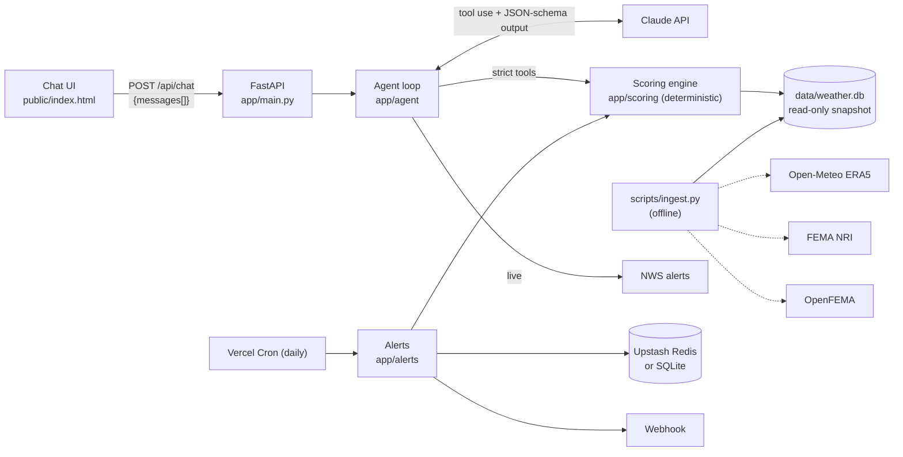

# Weather Risk Intelligence Agent

An AI agent that helps logistics analysts decide which US distribution hubs are most exposed to
weather disruption, and why. It ranks 22 hubs with **deterministic scoring** over public data
(Open-Meteo, FEMA, NWS). **Claude** handles the conversation, picks the right analysis tools and
explains the results. Its answers are returned in a JSON-schema-enforced format.

> Example questions: *Which hubs in the Midwest are most exposed to winter disruption?* ·
> *Compare Miami and Houston in terms of hurricane and flood exposure.* · *What percentage of
> days in Denver last year had snowfall?* · *Why is the Dallas hub's weather disruption risk high?*

**Contents:** [Quick start](#quick-start) · [How it works](#how-it-works) ·
[Scoring](#the-deterministic-score) · [Assumptions & limits](#assumptions-uncertainty-and-scope) ·
[Evaluation](#evaluation) · [Alerts](#risk-change-alerts-bonus) · [Deploy](#deploying-to-vercel) ·
[Architecture doc](docs/ARCHITECTURE.md)

---

## Quick start

Requirements: Python 3.12+ and an Anthropic API key.

```bash
git clone https://github.com/EladRab1106/MoveoAi.git && cd MoveoAi
python3 -m venv .venv && source .venv/bin/activate
pip install -r requirements-dev.txt
cp .env.example .env          # then set ANTHROPIC_API_KEY
uvicorn app.main:app --reload # open http://localhost:8000
```

The data snapshot (`data/weather.db`) is committed, so the app runs without fetching anything.

| Command | What it does |
|---|---|
| `uvicorn app.main:app --reload` | API + chat UI on http://localhost:8000 (API docs at `/docs`) |
| `python -m scripts.ask "your question"` | Ask the agent from the terminal (prints the full JSON response) |
| `pytest` | 45 unit/API tests (scoring math, ties, grounding checker, alerts). No API key needed |
| `python -m evals.run --dev` | 7-case eval subset against the live agent (~$0.90) |
| `python -m evals.run --judge` | Full 16-case eval + LLM-judge fact checks (~$2) |
| `python -m scripts.ingest` | Rebuild the data snapshot from the public APIs (~10 min; Open-Meteo rate limits) |
| `python -m scripts.ingest --only declarations` | Refresh one source only |

### Environment variables

| Variable | Required | Purpose |
|---|---|---|
| `ANTHROPIC_API_KEY` | yes | Claude API key |
| `ANTHROPIC_MODEL` | no | Default `claude-opus-5` |
| `ANTHROPIC_EFFORT` | no | `low`–`max`, default `medium` (latency vs depth) |
| `ANTHROPIC_WORKSPACE_ID` | no | Only for keys that aren't scoped to a workspace |
| `ALERT_WEBHOOK_URL` | no | Receives risk-change alerts (Slack-compatible JSON) |
| `CRON_SECRET` | no (yes in prod) | Protects `/api/alerts/check`; Vercel Cron sends it automatically |
| `UPSTASH_REDIS_REST_URL` / `_TOKEN` | no | Persistent alert storage (or Vercel's `KV_REST_API_URL` / `_TOKEN`) |

---

## How it works



1. **The data is ingested offline** into a committed SQLite snapshot: 2021-01-01 → late Sept 2026
   daily weather per hub, plus FEMA National Risk Index values and disaster declarations.
2. **The scoring engine is plain Python.** It turns the snapshot into per-hazard and composite
   scores, each with a full breakdown.
3. **The agent** (Claude, `claude-opus-5`, adaptive thinking) answers questions by calling
   7 **strict tools**: `rank_hubs`, `get_hub_risk`, `compare_hubs`, `weather_stat`,
   `get_active_alerts`, `get_methodology` and `list_hubs`. Each tool runs deterministic code.
4. **The final answer is constrained by JSON schema** (`output_config.format`) and then
   validated again with Pydantic (one repair retry). It has: `answer`, `hub_refs`, `reasoning`,
   `assumptions`, `data_sources`, `confidence`, `follow_up_suggestions` and `in_scope`.
5. **The LLM never supplies the displayed scores.** It only says *which* hubs it's discussing
   (`hub_refs`, limited to valid hub ids). The API attaches each hub's score, tier, rank and
   drivers from the engine.
6. **Multi-turn conversations:** the server is stateless. The client sends the conversation
   back each turn, and each response includes the `assistant_message` to append.

---

## The deterministic score

All constants live in [`config/scoring.yaml`](config/scoring.yaml).

**1. Disruption days per year.** A day counts as a disruption day if it crosses an operational
threshold:

| Category | Threshold |
|---|---|
| Winter | snowfall ≥ 2.5 cm, or min temp ≤ −18 °C |
| Wind | gust ≥ 70 km/h |
| Heavy rain | precipitation ≥ 50 mm |
| Heat | max temp ≥ 38 °C |

These are averaged over **full calendar years** (2021–2025).

**2. Hazard sub-score (0–100)** = `w_f × frequency + w_l × long-term`:
- **Frequency** is the disruption days per year, min-max normalized across the 22 hubs.
- **Long-term** is FEMA NRI's **loss-rate national percentile** for the hub's county. It
  covers rare events that 5 years of history can't capture.

| Hazard | Observed frequency | FEMA NRI component | Weights (f / l) |
|---|---|---|---|
| Winter | winter days | mean(winter weather, ice storm) | 0.6 / 0.4 |
| Hurricane | — | hurricane loss rate blended 50/50 with modelled events/yr | 0 / 1 |
| Flood | heavy-rain days | max(inland, coastal flooding) | 0.5 / 0.5 |
| Severe storm | wind days | mean(tornado, hail, strong wind) | 0.4 / 0.6 |
| Heat | heat days | heat wave | 0.6 / 0.4 |

**3. Composite** = 0.25·winter + 0.20·hurricane + 0.20·flood + 0.20·severe storm + 0.15·heat.
Live NWS Severe or Extreme alerts can add up to +15 points.

**4. Tiers:**

| Tier | Composite score |
|---|---|
| Critical | ≥ 50 |
| High | ≥ 40 |
| Moderate | ≥ 30 |
| Low | below 30 |

These cutoffs were calibrated to the observed spread of about 21–47.

**5. Ties share a rank** (1, 1, 3) and are listed explicitly (`tied_with`).

### Design decisions made from the data
- **FEMA loss-rate percentile instead of the headline risk score.** NRI's headline `RISK_SCORE`
  scales with exposed building value, so every big-metro county scores about 99 for nearly
  everything and the hubs can't be told apart. The loss-rate percentile is normalized for
  exposure.
- **Observed gusts are left out of the hurricane score.** Nor'easter gusts pushed Boston's
  hurricane score above Miami's.
- **Cold wave is left out of winter.** Its NRI loss rate is driven by crop-freeze losses
  (Miami-Dade ranks in the 91st percentile). Extreme cold is captured by the observed
  temperature threshold instead.
- **Only major disasters count as evidence.** Many hurricane *emergency* declarations
  (e.g. Dallas for Katrina and Rita) were for sheltering evacuees, not for damage. Only
  major-disaster (DR) declarations are counted; the declaration type is stored for every row.

---

## Assumptions, uncertainty and scope

- **Each hub is one point** (approximate metro coordinates). ERA5 reanalysis (~25 km grid)
  smooths local extremes, and FEMA NRI values describe the whole **county**, not the facility.
- **The observation window is 5 full years.** Rare events (hurricanes, major floods) are
  under-sampled in that window, which is why long-term NRI data is blended in. The agent
  lowers its `confidence` when evidence is thin.
- **Scores are relative to this portfolio**, not probabilities. Tiers are bands for
  prioritization.
- **"Last year" means the last full calendar year** (2025), never the trailing 12 months.
  If a period isn't covered, the agent refuses to estimate it. It may show clearly labeled
  figures for covered periods, but never as a stand-in.
- **Out of scope:** earthquakes, wildfire, drought, non-weather risk, and facility-specific
  mitigation. The agent flags these with `in_scope: false`.
- **Not modelled:** operational impact in hours or dollars. The scores rank *exposure*, not
  the return on a resilience investment.
- **Major-disaster declarations can still overstate local impact.** Some DR declarations
  (e.g. Dallas for Hurricane Harvey) cover evacuee-support costs. They are presented only as
  supporting evidence.
- **Voice input** uses the browser's Web Speech API (Chrome, Edge, Safari). The mic is hidden
  where the API is missing or its service fails. Add `?voice=1` for on-screen debug logs.

---

## Evaluation

[`evals/cases.yaml`](evals/cases.yaml) has 16 cases, covering:
- the 4 assignment questions
- multi-turn follow-ups
- an adversarial "just estimate 2012 for my slide" case
- an out-of-scope question, an unknown hub and a missing year
- rankings, methodology and live alerts

**Expected values aren't hard-coded.** They're computed from the scoring engine at run time,
so the evals stay valid after a data refresh.

| Check | How |
|---|---|
| `schema` | Response validates against the Pydantic/JSON schema |
| `grounded` | Every number in the answer traces to a tool output, within ±0.6 or 1%. Allowed derivations: ×100, differences or ratios of two tool numbers, and unit conversions when the unit is written |
| `tools` | Required tool calls with key arguments. Assignment questions only; elsewhere the focus is the answer |
| `top_k`, `hub_refs_*` | Rankings match the engine (ordered, or as a set) |
| `stat_number`, `hazard_days_number`, `tier_mentioned` | Specific values match the engine |
| `no_number_for_period` | No statistic stated for an unavailable period |
| `in_scope`, `mentions` | Scope flag and key concepts |
| `judge` (`--judge`) | Claude Sonnet 5 checks templated ground-truth facts and rates explanation quality |

```bash
python -m evals.run --dev -v          # 7-case dev subset, print answers
python -m evals.run --tags assignment # the 4 assignment questions
python -m evals.run --judge           # full set + judge; results saved to evals/results/
```

**Latest:** 16/16 cases pass. Every number in every answer traces to tool output. About 17 s
per turn and about $1.80 per full run. Details are in
[docs/ARCHITECTURE.md](docs/ARCHITECTURE.md#5-evaluation-results); raw runs are in
[`evals/results/`](evals/results/).

---

## Risk-change alerts (bonus)

A daily Vercel Cron job (`vercel.json`) calls `GET /api/alerts/check`:
1. It recomputes every hub's score, **including the live NWS alert bump**.
2. It compares the result with the last saved snapshot.
3. It records an alert when a score moves **≥ 5 points** or a **tier changes**.
4. It POSTs a Slack-compatible payload to `ALERT_WEBHOOK_URL`.

Day to day, the changes come from live NWS warnings; refreshing the data or editing the
scoring config also shows up here.

**Storage:** snapshots and the alert log use **Upstash Redis** when it's configured, and a local
SQLite file otherwise. Alerts are isolated from the rest of the app:
- The endpoints import the module lazily.
- NWS, webhook and storage failures are reported in the response, not raised.
- Chat and scoring keep working with no Redis and no webhook.

```bash
curl -X POST localhost:8000/api/alerts/check   # add -H "Authorization: Bearer $CRON_SECRET" if set
curl localhost:8000/api/alerts
```

---

## Deploying to Vercel

The repo deploys with Vercel's zero-config FastAPI support:
- `app/main.py` exports `app`.
- `public/` is served from the CDN.
- `vercel.json` sets `maxDuration` and the daily cron job.
- `data/weather.db` ships inside the function bundle and is opened read-only.

1. **Deploy:** `vercel deploy`, or import the GitHub repo in the Vercel dashboard.
2. **Environment variables:** in Project → Settings → Environment Variables, add
   `ANTHROPIC_API_KEY`, `CRON_SECRET`, and optionally `ALERT_WEBHOOK_URL`.
3. **Optional, persistent alerts:** Project → Storage → add **Upstash Redis** from the
   Marketplace. It injects the `KV_REST_API_*` / `UPSTASH_REDIS_*` variables automatically.
   Without it, alerts use an ephemeral SQLite file in `/tmp`, and `/api/alerts` reports
   `persistent: false`.

---

## Repository structure

```
app/
  main.py              FastAPI app: /api/chat, /api/scores, /api/hubs/{hub}/risk, /api/alerts…
  config.py            env vars, paths, scoring config loader
  hubs.py              hub registry + fuzzy name resolution
  agent/               agent loop, strict tool defs, system prompt, JSON schemas
  scoring/             deterministic engine + typed models
  data_sources/        Open-Meteo, FEMA NRI, OpenFEMA, NWS clients
  storage/db.py        SQLite snapshot schema/access
  alerts/              change detector, Redis/SQLite store, webhook, check service
config/scoring.yaml    every threshold, weight and tier
data/hubs.yaml         22 hubs with coordinates and county FIPS
data/weather.db        committed data snapshot (read-only at runtime)
public/index.html      chat UI (single static page, no build step)
evals/                 cases.yaml, run.py, results/
scripts/               ingest.py (build snapshot), ask.py (CLI)
tests/                 pytest suite
docs/ARCHITECTURE.md   design document
PLAN.md                the original plan
session/               exported AI-assistant session transcript
```
