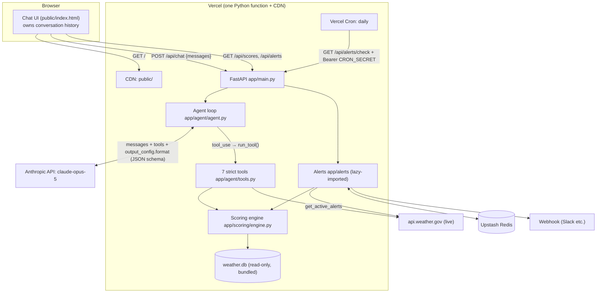

# Architecture: Weather Risk Intelligence Agent

The system is built on one rule: **code computes, the LLM explains.** Every score, rank and
count comes from deterministic Python over a versioned data snapshot. Claude decides *which*
analysis to run, interprets the results and communicates them. It has to cite tool outputs,
and the evals check that it does.

## 1. Components and how they talk



| Component | Responsibility | Talks to |
|---|---|---|
| **Chat UI** (`public/index.html`) | Static page, no build step. Renders answers, the engine-sourced hub table, collapsible reasoning/assumptions/tool trace, the leaderboard, alerts, voice input and read-aloud. Keeps the conversation history. | `POST /api/chat`, `GET /api/scores`, `/api/alerts`, `/api/health` |
| **API** (`app/main.py`) | FastAPI routing, input validation (Pydantic), error mapping (agent errors → 502, alert errors → 503). | Agent, engine, alerts (lazily) |
| **Agent loop** (`app/agent/agent.py`) | Hand-written tool-use loop (≤ 8 model turns). Runs parallel tool calls in a thread pool and validates the final JSON. Retries once on a schema error. Handles refusal / max_tokens / API errors. Attaches engine scores to `hub_refs`. | Anthropic API, tools |
| **Tools** (`app/agent/tools.py`) | 7 `strict: true` tool definitions. Each is a thin wrapper over the engine that returns compact JSON. | Engine, NWS |
| **Scoring engine** (`app/scoring/`) | Pure functions: thresholds, normalization, blending, tiers, competition ranking with ties, weather statistics. Results are cached per process. | Snapshot DB |
| **Data sources + ingest** (`app/data_sources/`, `scripts/ingest.py`) | Offline HTTP clients with retries. Build `data/weather.db`. Only NWS is called at request time. | Open-Meteo, FEMA NRI (ArcGIS), OpenFEMA, NWS |
| **Alerts** (`app/alerts/`) | Snapshot diff (pure), storage abstraction, webhook, check service. | Engine, NWS, Redis/SQLite, webhook |

### Request lifecycle (`POST /api/chat`)
1. **Client sends the history.** The UI posts `messages` (user text and earlier
   `assistant_message` JSON strings).
2. **The agent calls Claude** with:
   - the system prompt (rules, hub list, today's date, the "last year" definition)
   - 7 strict tools
   - `thinking: adaptive` and effort `medium`
   - `output_config.format`: the `LLMAnswer` JSON schema, with `hub_id` limited to the 22 ids
   - server-side `fallbacks: "default"` for safety-classifier declines
3. **Tools run.** While `stop_reason == tool_use`, all tool calls in the turn execute in
   parallel. Errors return as `is_error` tool results so the model can correct itself.
4. **The answer is validated.** On `end_turn`, the text block is parsed and validated against
   `LLMAnswer`.
5. **Scores are attached.** The API adds the engine's score, tier, rank and drivers for each
   referenced hub. It returns `{answer, assistant_message, hubs, tool_calls, model,
   latency_ms, usage}`.

### The LLM ↔ code contract
`LLMAnswer` (`app/agent/schemas.py`) is the structured format:

```json
{ "answer": "...", "hub_refs": [{"hub_id": "dallas", "role": "explained"}],
  "reasoning": ["..."], "assumptions": ["..."],
  "data_sources": ["fema_nri", "open_meteo_history", "scoring_engine"],
  "confidence": "high", "confidence_reason": "...",
  "follow_up_suggestions": ["..."], "in_scope": true }
```

The format is enforced three times:
1. **By the API**, through constrained decoding (`output_config.format`).
2. **By Pydantic**, when the server validates the response.
3. **By `strict: true` tool inputs**, so tool arguments are always valid as well.

## 2. Repository structure

```
app/
  main.py                 HTTP layer only
  config.py               env + paths + cached scoring config
  hubs.py                 Hub model, registry, name resolution ("St. Louis", "NYC" → id)
  agent/
    agent.py              tool-use loop, error handling, enrichment
    tools.py              tool implementations + JSON-schema definitions
    prompts.py            system prompt (date-aware "last year")
    schemas.py            LLMAnswer, ChatRequest/Response, traces
  scoring/
    engine.py             deterministic scoring + weather stats (pure core + snapshot wrappers)
    models.py             typed score breakdowns returned by tools and API
  data_sources/           one module per public API + shared retrying HTTP helper
  storage/db.py           snapshot schema
  alerts/                 detector.py (pure), store.py (Redis/SQLite), service.py
config/scoring.yaml       all tunable constants, each documented
data/                     hubs.yaml, weather.db (snapshot)
public/index.html         UI
evals/                    cases.yaml, run.py, results/*.json
scripts/                  ingest.py, ask.py
tests/                    45 offline tests
```

**Layering:** `data_sources → storage → scoring → agent/alerts → main`. Each layer only
imports layers below it. `scoring` knows nothing about LLMs, and `alerts` is never imported
by the chat path.

## 3. Data storage choice

| Data | Store | Why |
|---|---|---|
| Historical weather (≈ 46k daily rows), FEMA NRI, declarations | **SQLite snapshot** `data/weather.db` (4 MB), built offline, committed, opened read-only (`mode=ro`) on Vercel | The data changes slowly and is read-heavy, and SQLite needs no setup. A committed snapshot makes results **reproducible** (scores and evals are tied to a known dataset), avoids slow API calls during chat (Open-Meteo history takes seconds per hub and is rate-limited), and keeps the demo working if a public API is down. 4 MB fits easily in a serverless bundle. |
| Live NWS alerts | **In-process cache** (10 min TTL) | Must be current; small; it's fine to lose it on a cold start. |
| Conversation history | **Client** (browser memory) | Serverless instances share no memory. A stateless API is simpler, scales horizontally and needs no session store. Trade-off: history is lost on reload. |
| Alert snapshots + log | **Upstash Redis** (REST), with **SQLite fallback** | This is the only state that changes and must persist across serverless invocations. Redis over HTTP needs no connection pool and has a free tier on the Vercel Marketplace. The fallback keeps local development dependency-free. |

**Not chosen:**
- **Postgres:** unnecessary for 46k rows that are read-only at runtime. It would be the
  next step with many more hubs, multi-user saved analyses, or writes during requests.
- **A vector database:** the data is structured, and questions map to computations, not
  document retrieval.

## 4. Key design decisions and trade-offs

- **Hand-written tool loop instead of the SDK tool runner.** We need per-call traces (shown in
  the UI and used by the evals), parallel execution, one schema-repair retry, and explicit
  refusal handling.
- **Model: `claude-opus-5` at `medium` effort.** About 16–20 s per turn in testing (p50 17.2 s). Effort is
  configurable; `low` would trade explanation depth for speed.
- **The prompt rules were driven by evals.** These rules were added after reading real outputs:
  - describe thresholds only as the tools return them
  - name ties explicitly
  - "last year" means the last full calendar year
  - refuse to estimate missing periods, and don't recommend a substitute
- **Relative scoring.** Min-max normalization across the portfolio makes the scores useful for
  *ranking within this network*, which is what the investment decision needs. It is not an
  absolute risk measure, and adding or removing hubs shifts the scores. This is documented
  in the tool output and in the methodology tool.
- **Grounding check with tolerance.** It accepts rounding, percent conversion, differences or
  ratios of two tool values, and unit conversions only when the unit is written. This avoids
  false alarms while still catching invented numbers (tested in `tests/test_eval_grounding.py`).

## 5. Evaluation results

**Final: 16/16 cases pass** on `claude-opus-5` (effort `medium`), with the Claude Sonnet 5 judge.
The full run (`evals/results/20261006-152249.json`) completed 14/16. All 14 passed every
check; the other 2 (`methodology`, `live_alerts`) hit an API credit limit mid-run and never
reached the agent. They were rerun alone and passed (`evals/results/20261006-152705.json`).

| Check | Result |
|---|---|
| Numbers grounded in tool outputs | 19/19 turns |
| Schema valid | 19/19 turns |
| Rankings match the engine (`top_k`) | 5/5 |
| Required tool calls (assignment questions) | 4/4 |
| Judge fact checks + explanation quality | 2/2 |
| Scope flag / key concepts / no number for a missing period | 5/5 · 9/9 · 1/1 |
| Engine values (stat %, days/yr, tier) | 4/4 |

| | Full run | Rerun (2 cases) |
|---|---|---|
| Latency per turn, p50 / p95 | 17.2 s / 17.9 s | 19.4 s / 22.6 s |
| Tokens (in / out) | 225k / 20k | 20k / 2k |
| Estimated cost | $1.64 | $0.15 |

How the eval set evolved during development (all runs are kept in `evals/results/`):

| Run | Cases | Result | Note |
|---|---|---|---|
| Assignment questions, first live run | 4 | 4/4 | Reading the answers exposed 3 issues: evacuee "hurricane" declarations, ties called "highest", an invented "snow-depth" rule |
| Dev subset after those fixes | 7 | 6/7 | The failure came from an over-strict check (any % banned); the agent refused 2012 correctly |
| Adversarial case after prompt + check fix | 1 | 1/1 | Agent now also declines to suggest a proxy for the missing year |
| Full set + judge | 16 | 14/16 + 2/2 rerun | See above |

## 6. Known limitations and next steps

- **Facility-level detail.** Use exact facility coordinates and, where possible, site
  elevation or flood-zone data (FEMA NFHL) instead of metro points and county-level NRI.
- **Longer history.** Lengthen the observation window (e.g. 20–30 years) to stabilize the
  frequency of rare events; keep the 5-year window as a "recent trend" signal.
- **Return on investment.** Translate exposure into expected downtime days and cost per hub,
  so the ranking becomes an investment case.
- **Streaming responses.** Stream to the UI (SSE) to cut perceived latency.
- **Alert delivery.** Per-user alert subscriptions; deduplicate alerts while a single NWS
  event is still active.
- **Methodology wording.** `get_methodology` returns the snapshot's date range but not the
  rule that frequency uses full calendar years only (2021–2025). The agent can therefore
  describe the frequency window as the whole snapshot. The scores themselves are unaffected.
  The fix is to add that rule to the tool output.
